# IESB Infrastructure Chatbot

AWS infrastructure automation for IESB Data Science classroom. This project supports teachers and students by providing the necessary infrastructure and tools for developing chatbots using Amazon Bedrock and LangChain within an EC2 instance for educational purposes.

## Project Goal

The goal is to support the infrastructure needs of Data Science education and provide teachers with the tools necessary to effectively work with their students in a cloud-based learning environment. This eliminates setup complexity and allows focus on learning AI/ML concepts.

## Educational Context

This infrastructure supports a Data Science classroom where students learn to build AI chatbots. Students share a dedicated EC2 instance with pre-configured environments for developing applications using:
- **Amazon Bedrock** for accessing Large Language Models (LLMs)
- **LangChain** as the application development framework
- **Python ecosystem** for data science and AI development

## How It Works

1. **Infrastructure Provisioning**: Roberto uses Terraform to create an EC2 instance, DynamoDB table, and IAM permissions
2. **Credential Management**: Terraform automatically stores student login credentials in DynamoDB
3. **Notification System**: Roberto runs a Python script that retrieves credentials from DynamoDB and sends login instructions to the teacher via SNS
4. **Distribution**: Teacher receives the credentials and forwards them to students
5. **Student Access**: Students use the credentials to access the shared EC2 instance for chatbot development

## Architecture

```mermaid
graph TB
    subgraph "Management"
        Roberto[👨‍💻 Roberto<br/>Infrastructure Manager]
    end
    
    subgraph "Infrastructure"
        TF[🏗️ Terraform<br/>Infrastructure]
        subgraph EC2[💻 EC2 Instance]
            ENV[Student Environment]
            FAISS[(🗄️ FAISS<br/>Vector Database)]
        end
        DDB[(DynamoDB<br/>Credentials)]
        IAM[🔐 IAM<br/>User Permissions]
    end
    
    subgraph "Operations"
        Script[📜 Python Scripts]
        SNS[📧 SNS<br/>Quick Notifications]
    end
    
    subgraph "Users"
        Teacher[👨‍🏫 Teacher]
        Students[👥 Students]
    end
    
    subgraph "AI Services"
        Bedrock[🤖 Amazon Bedrock<br/>LLM Models]
        LangChain[🔗 LangChain<br/>Framework]
    end
    
    Roberto --> TF
    Roberto --> Script
    
    TF --> EC2
    TF --> DDB
    TF --> IAM
    
    Script --> DDB
    Script --> SNS
    
    SNS --> Teacher
    Teacher --> Students
    
    Students --> EC2
    
    EC2 --> Bedrock
    EC2 -.-> LangChain
    
    IAM --> Teacher
    IAM --> Students
    IAM --> EC2
```



## Features

- **Teacher Support Tools**: Automated provisioning and management scripts
- **Student Environment Setup**: Pre-configured EC2 instance ready for chatbot development
- **Credential Management**: Secure storage and automated distribution of login credentials
- **Communication System**: Email notifications for login instructions and updates
- **Educational Focus**: Eliminates infrastructure complexity, allowing focus on AI/ML learning

## Infrastructure Components

### For Teachers
- Full EC2 access and management capabilities
- Automated student environment provisioning
- Credential management and distribution system
- Monitoring and maintenance tools

### For Students
- AWS console access with EC2 readonly permissions
- EC2 Instance Connect access to the shared development instance
- Access to Amazon Bedrock models for AI development
- Shared development environment for chatbot projects

## Scripts

### send_login_instructions.py
Retrieves student credentials from DynamoDB and sends login instructions via SNS.

```bash
python3 scripts/send_login_instructions.py
```

## Student Development Environment

The EC2 instance includes pre-configured development tools and frameworks for chatbot development.

## AWS Services Used

- **EC2**: Shared student development instance
- **DynamoDB**: Secure credential storage and management
- **SNS**: Email notification system for login instructions
- **Amazon Bedrock**: LLM model access for chatbot development
- **IAM**: Role-based access control and permissions

## Requirements

- Python 3.x
- boto3 library
- AWS CLI configured with appropriate permissions
- Teacher account with full EC2 management access

## Setup

1. Configure AWS credentials with required permissions
2. Update DynamoDB table name in scripts as needed
3. Verify SNS topic permissions and email subscriptions
4. Ensure Bedrock model access in the target region
5. Run provisioning scripts to create student environments

## Terraform Deployment

```bash
# Initialize Terraform
terraform init

# Plan deployment
terraform plan

# Apply infrastructure
terraform apply
```

## Credits

Infrastructure automation and educational framework designed with assistance from Amazon Q Developer.
